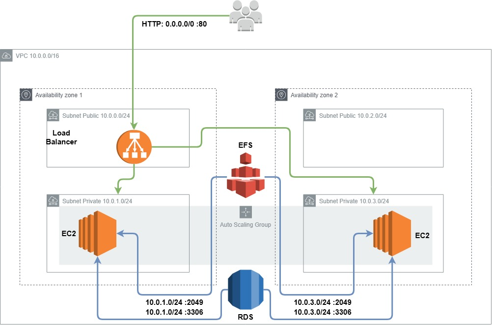

# Instalação do Wordpress utilizando uma máquina EC2
O programa de bolsas da **Compass Uol** apresentou o desafio de subir instâncias EC2 na AWS com um conteiner com a imagem do Wordpress, utilizando um banco de dados e um sistema de volumes fornecidos pela AWS, de forma escalável e segura. Para realização dessa tarefa, os seguintes passos foram seguidos:

- [ Criação da VPC](#-criação-da-vpc)
- [ Security Groups](#-security-groups)
- [ Banco de dados RDS](#-banco-de-dados-rds)
- [ Montagem do EFS](#-montagem-do-efs)
- [ Montagem inicial da EC2](#-montagem-inicial-da-ec2)
- [Docker Compose (yaml file)](#docker-compose-yaml-file)
- [ Script para atualização do Banco de dados (Opcional)](#-script-para-atualização-do-banco-de-dados-opcional) 
- [ Arquivo user_data.sh](#-arquivo-user_datash)
- [ Template para EC2](#-template-para-ec2)
- [ NAT Gateway](#-nat-gateway)
- [ Bastion Host](#-bastion-host)
- [ Load Balancer](#-load-balancer)
- [ Auto Scaling Group](#-auto-scaling-group)
- [ Stress Test](#-stress-test)
- [ Cloud Formation](#-cloud-formation)

  
##  Criação da VPC

Desenhou-se um modelo de VPC para acomodar toda a infraestrutura do projeto. Para isso, guardou-se os dois primeiros octetos (16 bits) para indicar a VPC que será utilizada (10.0.x.x), para realizar essa indicação, a notação é 10.0.0.0/16.
Com a VPC criada, foram criadas 4 sub-redes utilizando o terceiro octeto (sendo asism fixados 24 bits), na zona us-east-1a foi criada uma pública com IPs 10.0.0.0/24 e uma privada com IPs 10.0.1.0/24, na zona us-east-1b foi criada uma pública com IPs 10.0.2.0/24 e uma privada com IPs 10.0.3.0/24. As sub-redes públicas recebem acesso a internet via internet gateway com acesso irrestrito (0.0.0.0/0) enquanto as privadas não recebem acesso a internet até então.
Para que as redes consigam acessar o gateway, é necessário uma tabela de rotas, desta forma a estrutura da VPC possui o seguinte formato:

<table><thead>
  <tr>
    <th colspan="4" >VPC</th>
  </tr></thead>
<tbody>
  <tr>
    <td colspan="4"> 10.0.x.x </td>
  </tr>
  <tr>
    <td colspan="2" >us-east-1a</td>
    <td colspan="2">us-east-1b</td>
  </tr>
  <tr>
    <td>Publica</td>
    <td>Privada</td>
    <td>Publica</td>
    <td>Privada</td>
  </tr>
  <tr>
    <td>10.0.0.x</td>
    <td>10.0.1.x</td>
    <td>10.0.2.x</td>
    <td>10.0.3.x</td>
  </tr>
</tbody>
</table>

  

  

##  Security Groups

Com a VPC criada, é importante definir quais os grupos de segurança, dessa forma pode-se indicar as permissões de acesso dentro das subredes. O banco de dados RDS e o sistema de volumes EFS serão colocados em um grupo privado, onde apenas as instancias privadas tem acesso a eles.
O banco de dados é acessado pela porta 3306, por isso define-se o acesso a 10.0.1.0/24:3306 e 10.0.3.0/24:3306.
O EFS é acessado pela porta 2049, por isso define-se o acesso a 10.0.1.0/24:2049 e 10.0.3.0/24:2049.
Para acessar as instancias privadas durante o processo, criou-se um Bastion Host em uma subnet publica para que com ele se consiga acessar as instancias privadas. É necessário assim criar um grupo de segurança para ele, conferindo acesso via protocolo SSH na porta 22 para todos (0.0.0.0/0). 
Criou-se um grupo de segurança para o load balancer com acesso irrestrito a porta HTTP 80 e a porta HTTPS 443.
Além desses, foi criado um grupo de segurança para as máquinas privadas com acesso via SSH na porta 22 apenas para quem faz parte da VPC (10.0.0.0/16), acesso ao banco de dados e ao EFS e acesso via HTTP e HTTPS via load balancer.

  

### Inbound do project-wordpress-RDS

|SERVIÇO         |MAPEAMENTO                     |PORTA                        |
|----------------|-------------------------------|-----------------------------|
|MYSQL           |10.0.1.0/24                    |3306                         |
|MYSQL           |10.0.3.0/24                    |3306                         |

### Inbound do project-wordpress-EFS

|SERVIÇO         |MAPEAMENTO                     |PORTA                        |
|----------------|-------------------------------|-----------------------------|
|NFS             |10.0.1.0/24                    |2049                         |
|NFS             |10.0.3.0/24                    |2049                         |

### Inbound do project-wordpress-LB

|SERVIÇO         |MAPEAMENTO                     |PORTA                        |
|----------------|-------------------------------|-----------------------------|
|HTTP            |0.0.0.0/0                      |80                           |
|HTTPS           |0.0.0.0/0                      |443                          |

### Inbound do project-wordpress-priv-sg

|SERVIÇO         |MAPEAMENTO                     |PORTA                        |
|----------------|-------------------------------|-----------------------------|
|MYSQL           |project-wordpress-RDS          |3306                         |
|NFS             |project-wordpress-EFS          |2049                         |
|SSH             |10.0.0.0/16                    |22                           |
|HTTP            |project-wordpress-LB           |80                           |
|HTTPS           |project-wordpress-LB           |443                          |

### Inbound do project-wordpress-pub-sg

|SERVIÇO         |MAPEAMENTO                     |PORTA                        |
|----------------|-------------------------------|-----------------------------|
|SSH             |0.0.0.0/0                      |22                           |

##  Banco de dados RDS

Para o funcionamento do Wordpress, é necessário ter um banco de dados MySQL associado a ele como dependência, para isso, utilizou-se do serviço da AWS chamado RDS (Relational Databases Service). Com ele é possível criar um banco de dados dentro da VPC. Utilizou-se os seguintes parametros:
- Engine Options
  - Engine type: MySQL
  - Engine version: 8.0.39
- Templates: Free tier
- Settings
  - DB instante id: database-1
  - Master username: secret
  - Master password: secret
- Instance Configuration
  - instance type: db.t3.micro
- Connectivity
  - VPC: project-wordpress-vpc
  - VPC security groups: project-wordpress-RDS
  - Availability Zone: No preference (us-east-1a e us-east-1b)
- Additional configuration
  - Initial database name: wordpressdb

As informações do banco serão utilizadas no yaml file do docker-compose que irá subir o conteiner do wordpress.

##  Montagem do EFS

Para garantir que os dados da aplicação persistam independentemente das instâncias EC2, é necessário ter um volume a parte. A Amazon fornece alguns serviços para essa função, um deles é o EFS (Elastic File System). 
Ao criar um EFS, indica-se a VPC a ser utilizada e clica-se em Customize para poder indicar o security group ao qual ele deve ser associado.
- General
  - Name: project-wordpress-efs
  - File system type: Regional
  - Throughput mode: Enhanced
- Network
  - VPC: project-wordpress-vpc
  - Mount targets
  - MT1:
    - Availability zone: us-east-1a
    - Subnet ID: wordpress-machine1-priv
    - IP address: Automatic
    - Security groups: project-wordpress-EFS
  - MT2:
    - Availability zone: us-east-1b
    - Subnet ID: wordpress-machine2-priv
    - IP address: Automatic
    - Security groups: project-wordpress-EFS

##  Montagem inicial da EC2

Para as configurações e testes iniciais, cria-se uma instancia EC2 limpa e com ela instala-se o docker, monta-se o EFS, instala-se o docker-compose e realiza-se o teste se todos os passos seguidos estão funcionando conforme o esperado. A instancia EC2 é criada com os seguintes parâmetros:
- Name and tags

|Key             |Value                          |Resource types               |
|----------------|-------------------------------|-----------------------------|
|Name            |*Fornecido pela Compasso*      |Instances & Volumes          |
|CostCenter      |*Fornecido pela Compasso*      |Instances & Volumes          |
|Project         |*Fornecido pela Compasso*      |Instances & Volumes          |
|Nome            |EC2 de teste                   |Instances & Volumes          |

- Application and OS Images
  - Quick Start: Ubuntu
  - AMI: Ubuntu Server 24.04 LTS
- Instance type: t2.micro
- key pair: Criada utilizando ED25519 .pem com a pública armazenada.
- Network settings - EDIT
  - VPC: project-wordpress-vpc
  - Subnet: wordpress-machine1-pub
  - Auto-assign public IP: Disable
  - Select existing security group
  - common security groups: project-wordpress-pub-sg
- Configure storage
  - root volume: 8gb gp2

Com a instancia criada, utiliza-se da conexão via ssh utilizando a chave pública e o endereço de ip da máquina.

~~~bash
sudo chmod 400 chavePub.pem
ssh -i chavePub.pem ubuntu@x.x.x.x
~~~

Onde no lugar de chavePub indica-se o nome da chave criada e em x.x.x.x indica-se o ipv4 da máquina criada.
> Importante lembrar que deve-se estar no diretório da chave para que o comando funcione, ou indicar o diretório da chave diretamente no comando.

Os security Groups devem ser alterados para que possa ser utilizada a maquina pública com todo o sistema funcionando nela:

### Inbound do project-wordpress-pub-sg MOMENTÂNEO

|SERVIÇO         |MAPEAMENTO                     |PORTA                        |
|----------------|-------------------------------|-----------------------------|
|SSH             |0.0.0.0/0                      |22                           |
|MYSQL           |project-wordpress-RDS          |3306                         |
|NFS             |project-wordpress-EFS          |2049                         |
|HTTP            |0.0.0.0/0                      |80                           |
|HTTPS           |0.0.0.0/0                      |443                          |

### Inbound do project-wordpress-RDS MOMENTÂNEO

|SERVIÇO         |MAPEAMENTO                     |PORTA                        |
|----------------|-------------------------------|-----------------------------|
|MYSQL           |10.0.0.0/24                    |3306                         |
|MYSQL           |10.0.2.0/24                    |3306                         |

### Inbound do project-wordpress-EFS MOMENTÂNEO

|SERVIÇO         |MAPEAMENTO                     |PORTA                        |
|----------------|-------------------------------|-----------------------------|
|NFS             |10.0.0.0/24                    |2049                         |
|NFS             |10.0.2.0/24                    |2049                         |

Após acessar a máquina, tenta-se instalar o docker, iniciar o serviço, fornecer o direito de acesso ao docker ao usuário e habilitar para que o serviço do docker inicie sozinho na próxima reinicialização da máquina:

~~~bash
sudo apt update
sudo apt upgrade

sudo apt-get install docker.io -y
sudo systemctl start docker
sudo usermod -aG docker ubuntu
sudo systemctl enable docker
~~~

Com o docker instalado, instala-se o efs-utils para conseguir montar o EFS. A ferramenta efs-utils vem por padrão no yum nas instancias Amazon Linux, mas nas instancias ubuntu utiliza-se o nfs-common.
Após instalado, é necessário criar uma pasta onde será montado o EFS, decidiu-se montar em /efs. Para que este disco persista na montagem, é necessário indicar no /etc/fstab a montagem desse disco.
O comando para a montagem do disco pode ser obtido clicando em Attach no EFS, existem duas opções, via DNS e via IP, escolhi a oção via IP e defini a zona.

~~~bash
#Instala o nfs-common e monta o efs no sistema
sudo apt-get -y install nfs-common
sudo mkdir /efs
sudo mount -t nfs4 -o nfsvers=4.1,rsize=1048576,wsize=1048576,hard,timeo=600,retrans=2,noresvport 10.0.0.49:/ /efs
sudo chmod 666 /etc/fstab
sudo echo "10.0.0.49:/     /efs      nfs4      nfsvers=4.1,rsize=1048576,wsize=1048576,hard,timeo=600,retrans=2,noresvport,_netdev      0      0" >> /etc/fstab
~~~

Após a instalação do EFS é possível notar que ele está montado com o comando:

~~~bash
df -h
~~~

  

Após a montagem do EFS, pode-se instalar o docker-compose

~~~bash
sudo curl -L https://github.com/docker/compose/releases/latest/download/docker-compose-$(uname -s)-$(uname -m) -o /usr/local/bin/docker-compose
sudo chmod +x /usr/local/bin/docker-compose
~~~

Com o docker-compose instalado, é possível realizar o teste para subir a instancia. Para isso, é necessário criar o yaml file.
  
## Docker Compose (yaml file)

O Docker Compose permite que se escreva um arquivo onde se define todas as informações necessárias para subir um conteiner sem a necessidade de realizar todas as configurações via linha de comando. O Wordpress necessita alocar arquivos e dados, os arquivos serão alocados em um volume, no caso o EFS, e os dados serão alocados em um banco de dados, no caso o MySQL criado com o RDS. Para garantir segurança nos dados, utilizou-se de secrets no yaml file. Indica-se o serviço que será criado, a imagem que ser´´a utilizada, garante a reinicialização do serviço e indica-se a porta, onde na porta 8080 será escutado todo o tráfego vindo da porta 80 do conteiner. Indica-se as variáveis de ambiente confidenciais via secrets e não confidenciais diretamente. Indica-se as secrets e depois o volume, que receberá os dados vindos da pasta /var/html/www do container e alocará na pasta /efs/website do EFS. Os arquivos onde serão coletados os secrets é indicado abaixo. eles serão salvos dentro do container em /var/secrets/.

~~~yaml
services:
  wordpress:
    image: wordpress
    restart: always
    ports:
      - 80:80
    environment:
      WORDPRESS_DB_HOST_FILE: /run/secrets/db_host
      WORDPRESS_DB_USER_FILE: /run/secrets/db_user
      WORDPRESS_DB_PASSWORD_FILE: /run/secrets/db_password
      WORDPRESS_DB_NAME: wordpressdb
    secrets:
      - db_host
      - db_password
      - db_user
    volumes:
      - /efs/website:/var/www/html

secrets:
  db_password:
    file: db_password.txt
  db_host:
    file: db_host.txt
  db_user:
    file: db_user.txt
~~~

Com o arquivo criado, basta utilizar o docker compose indicando o nome do arquivo para que ele suba a instancia em background

~~~bash
docker-compose -f wordpress.yaml up -d
~~~

Com a instância criada, acessa-se o endereço dado pelo ip publico da maquina seguido de :80 para verificar se na porta 80 o serviço está funcionando.

##  Script para atualização do Banco de dados (Opcional)

Como o banco de dados armazena o IP que deve ser acessado em wp_options e a máquina muda de IP a cada nova criação, foi necessário atualizar a url para o acesso correto. Esta URL está no wp_options onde o 'option_name' é 'siteurl', deve ser alterado o option_value para http://(ipv4 publico):8080. Para isso, foi criado um script que acessa o banco de dados e altera essa parte do banco de dados. Esse script foi salvo em /efs/script_sql.sh

~~~bash
#!/bin/bash
IP_EX2="UPDATE wp_options SET option_value = 'http://$(curl http://checkip.amazonaws.com):8080' WHERE option_name = 'siteurl';"

sudo apt install mysql-client -y
host=$(cat /efs/db_host.txt) && user=$(cat /efs/db_user.txt) && pw=$(cat /efs/db_password.txt)

mysql -h $host -u $user -p$pw wordpressdb -e "$IP_EX2"
~~~

##  Arquivo user_data.sh

Com tudo funcionando na instância de teste, pode-se preparar um arquivo executável responsável por realizar todos os comandos assim que uma instancia for criada, para isso a AWS fornece um serviço na criação da isntancia para indicar um user_data.sh. Este arquivo é executado no momento de criação da instância. Reunindo todos os códigos utilizados na instancia de teste, tem-se o seguinte user_data.sh:

~~~bash
#!/bin/bash

#Atualiza a lista de pacotes
sudo apt update

#Atualiza os pacotes
sudo apt upgrade

#Instala o Docker, starta e garante que inicia junto ao sistema
sudo apt-get install docker.io -y
sudo systemctl start docker
sudo usermod -aG docker ubuntu
sudo systemctl enable docker

#Instala o nfs-common e monta o efs no sistema
sudo apt-get -y install nfs-common
sudo mkdir /efs
sudo mount -t nfs4 -o nfsvers=4.1,rsize=1048576,wsize=1048576,hard,timeo=600,retrans=2,noresvport 10.0.0.49:/ /efs
sudo chmod 666 /etc/fstab
sudo echo "10.0.0.49:/     /efs      nfs4      nfsvers=4.1,rsize=1048576,wsize=1048576,hard,timeo=600,retrans=2,noresvport,_netdev      0      0" >> /etc/fstab

#Instala o Docker compose
sudo curl -L https://github.com/docker/compose/releases/latest/download/docker-compose-$(uname -s)-$(uname -m) -o /usr/local/bin/docker-compose
sudo chmod +x /usr/local/bin/docker-compose

#Sobe o conteiner do Wordpress
sudo docker-compose -f /efs/wordpress.yaml up -d

#Atualiza o mysql com o ip atual (Caso esteja utilizando IP dinâmico)
#sudo bash /efs/script_sql.sh
~~~
  
##  Template para EC2

Com o user_data.sh montado, é possível definir um template que será utilizado para criar novas instancias, sem a necessidade de configurar tudo novamente a cada instancia EC2 criada.
A AWS possui a ferramenta Launch Templates, onde clica-se em Create Launch Template. As informações utilizadas foram:

- Launch Template Name: Project-Wordpress-EC2-private
- Auto Scaling guidance: Ativo
- Application and OS Images
  - Quick Start: Ubuntu
  - AMI: Ubuntu Server 24.04 LTS
- Instance type: t2.micro
- key pair: Criada utilizando ED25519 .pem com a pública armazenada.
- Network settings
  - Subnet: wordpress-machine1-pvt
  - Select existing security group
  - Common security groups: project-wordpress-priv-sg
  - Advanced network configuration
    - Auto-assign public IP: Disable
- Storage (volumes)
  - Volume 1 (AMI Root)
    - root volume: 8gb gp2
- Resource Tags

|Key             |Value                          |Resource types               |
|----------------|-------------------------------|-----------------------------|
|Name            |*Fornecido pela Compasso*      |Instances & Volumes          |
|CostCenter      |*Fornecido pela Compasso*      |Instances & Volumes          |
|Project         |*Fornecido pela Compasso*      |Instances & Volumes          |
|Nome            |Private EC2                    |Instances & Volumes          |

- Advanced details
  - User data - optional: Informar o user_data.sh
> Importante notar que a instância será criada em uma rede privada, para garantir a segurança.
 
##  NAT Gateway

O template criado gera máquinas na parte privada e isso gera dois problemas, o primeiro é que essas máquinas não possuem acesso a internet, pois as subnets privadas não estão associadas ao internet gateway. Para garantir a segurança, de forma que a máquina possa acessar a internet e baixar pacotes, mas a internet não possa acessar a máquina, deve ser criado um NAT Gateway. Para isso, em VPC -> NAT gateway, clica-se em Create NAT Gateway. O nome utilizado foi **project-wordpress-nat** e escolhe-se uma subnet pública em que ele deve estar, escolheu-se a subnet **wordpress-machine1-pub** com conectividade **Public** e clica-se em **Allocate Elastic IP**.
Ao criar o NAT Gateway, deve-se associa-lo à tabela de rotas para a parte privada. Para isso, em VPC -> Route tables, acessa-se a tabela de rotas **project-wordpress-rt-pvt** e em Routes -> Edit Routes adiciona-se uma rota para 0.0.0.0/0 Com um NAT Gateway e escolhe-se o NAT criado **project-wordpress-nat** e salva as mudanças. Com isso, as instâncias privadas passam a ter acesso a internet, mas não podem ser acessadas via SSH ainda.

##  Bastion Host

Para acessar as máquinas privadas e conseguir realizar testes nelas, é necessário criar uma máquina na parte pública, que pode ser acessada via SSH e essa máquina pública possui acesso às máquinas privadas. **Essa máquina** que o único papel é o de dar acesso às máquinas privadas **existe apenas no momento de teste**, após tudo pronto ela não é mais necessária.

  

Na parte de Launch Templates, clica-se em Create Launch Template. As informações utilizadas foram:

- Launch Template Name: Project-Wordpress-Bastion-Host
- Auto Scaling guidance: Desativado
- Application and OS Images
  - Quick Start: Ubuntu
  - AMI: Ubuntu Server 24.04 LTS
- Instance type: t2.micro
- key pair: Criada utilizando ED25519 .pem com a pública armazenada.
- Network settings
  - Subnet: wordpress-machine1-pub
  - Select existing security group
  - Common security groups: project-wordpress-pub-sg
  - Advanced network configuration
    - Auto-assign public IP: Disable
- Storage (volumes)
  - Volume 1 (AMI Root)
    - root volume: 8gb gp2
- Resource Tags

|Key             |Value                          |Resource types               |
|----------------|-------------------------------|-----------------------------|
|Name            |*Fornecido pela Compasso*      |Instances & Volumes          |
|CostCenter      |*Fornecido pela Compasso*      |Instances & Volumes          |
|Project         |*Fornecido pela Compasso*      |Instances & Volumes          |
|Nome            |Bastion Host                   |Instances & Volumes          |

 > Com essas configurações e **com os Security Groups nas confiruações inicialmente mencionadas** o sistema irá funcionar.

### Inbound do project-wordpress-RDS

|SERVIÇO         |MAPEAMENTO                     |PORTA                        |
|----------------|-------------------------------|-----------------------------|
|MYSQL           |10.0.1.0/24                    |3306                         |
|MYSQL           |10.0.3.0/24                    |3306                         |

### Inbound do project-wordpress-EFS

|SERVIÇO         |MAPEAMENTO                     |PORTA                        |
|----------------|-------------------------------|-----------------------------|
|NFS             |10.0.1.0/24                    |2049                         |
|NFS             |10.0.3.0/24                    |2049                         |

### Inbound do project-wordpress-LB

|SERVIÇO         |MAPEAMENTO                     |PORTA                        |
|----------------|-------------------------------|-----------------------------|
|HTTP            |0.0.0.0/0                      |80                           |
|HTTPS           |0.0.0.0/0                      |443                          |

### Inbound do project-wordpress-priv-sg

|SERVIÇO         |MAPEAMENTO                     |PORTA                        |
|----------------|-------------------------------|-----------------------------|
|MYSQL           |project-wordpress-RDS          |3306                         |
|NFS             |project-wordpress-EFS          |2049                         |
|SSH             |10.0.0.0/16                    |22                           |
|HTTP            |project-wordpress-LB           |80                           |
|HTTPS           |project-wordpress-LB           |443                          |

### Inbound do project-wordpress-pub-sg

|SERVIÇO         |MAPEAMENTO                     |PORTA                        |
|----------------|-------------------------------|-----------------------------|
|SSH             |0.0.0.0/0                      |22                           |

Cria-se primeiro o Bastion Host. Em Instances, O botão de Launch instances possui uma seta na lateral onde pode-se escolher a opção **Launch instance from template** escolhe-se o template do Bastion Host e clica-se em **Launch instance**. Quando a instância for criada, deve-se passar a chave ssh para dentro dela. Para isso deve-se realziar o comando de copia com segurança, o security copy (scp). Indica-se o comando, -i para indicar a chave, indica-se a chave de segurança utilizada para realizar a cópia, depois o arquivo que deve ser copiado e depois o destino ao qual esse arquivo deve ir:

~~~bash
sudo scp -i chavePub.pem chavePub.pem ubuntu@x.x.x.x:/home/ubuntu
ssh -i chavePub.pem ubuntu@x.x.x.x
ls
~~~

Onde no lugar de chavePub indica-se o nome da chave criada e em x.x.x.x indica-se o ipv4 do Bastion Host. A chave deve aparecer dentro do Bastion Host. Caso tenha aparecido, pode-se criar a máquina privada a partir do template. Em Instances, na seta na lateral de Launch instances pode-se escolher a opção **Launch instance from template**, escolhe-se o template do Project-Wordpress-EC2-private e clica-se em **Launch instance**. Quando a máquina estiver criada, a partir do Bastion Host, pode-se acessar a máquina:

~~~bash
ssh -i chavePub.pem ubuntu@x.x.x.x
ls
~~~

Onde no lugar de chavePub indica-se o nome da chave criada e em x.x.x.x indica-se o ip privado da máquina privada criada. Alguns testes podem ser feitos, o primeiro para verificar se a máquina acessa a internet via NAT Gateway.

~~~bash
sudo apt update
~~~

Caso realize o apt update, pode-se verificar se o docker está instalado

~~~bash
docker -v
~~~

Caso o docker esteja instalado, pode-se verificar se o EFS foi montado

~~~bash
df -h
~~~

Se foi montado, pode-se verificar se o docker compose subiu a imagem do wordpress

~~~
docker ps -a
~~~

Caso tenha subido, pode-se testar se a imagem conseguiu acesso ao banco, verificando se a página de instalação do Wordpress carrega normalmente

~~~bash
curl localhost/wp-admin/install.php
~~~

Caso tudo tenha funcionado normalmente, está na hora de implementar uma forma de um usuário comum, externo a VPC, conseguir acessar nossa página wordpress. Para isso, será utilizado um Load Balancer.

##  Load Balancer

O Load balancer é um sistema que verifica a integridade das instancias e a partir do algoritmo Round Robin escolhe uma para que seja exposta a internet. Por enquanto, nosso projeto só possui uma instância, mas ele analisará se esta instância é saldável e caso seja irá expor a mesma a internet via seu endereço de DNS.
Para criar, em EC2 -> Load Balancers clica-se na seta ao lado de Create load balancer e clica-se em **Create Classic Load Balancer**. Utilizou-se os seguintes parâmetros:

- Load Balancer Name: project-wordpress-lb
- Scheme: Internet-facing
- VPC: project-wordpress-vpc
- Availability Zones
  - us-east-1a: Ativo
  - Subnet: wordpress-machine1-pub
  - us-east-1b: Ativo
  - Subnet: wordpress-machine2-pub
- Security Groups: project-wordpress-lb-sg
- listeners and routing
  - Listener port: 80
  - Instance port: 80
- Health checks
  - Ping path: /wp-admin/index.php
- Instances: Add instances
  - Seleciona a instancia privada e confirma

Criando assim o Load Balancer.
Pode-se verificar se está funcional ao acessa-lo, clicando em Target instances e verificando se o Health status está "in service". Caso esteja funcional, basta copiar o DNS name seguido de **/wp-admin** no navegador e a página de instalação do wordpress aparecerá.

  

##  Auto Scaling Group

Para que caso o serviço peça mais recursos do que a instância EC2 possa fornecer, é possível definir um Auto Scaling Group, onde indica-se qual a métrica que deve ser utilizada para indicar se é necessário subir uma nova instancia para auxiliar e quantas instâncias devem estar rodando no mínimo, no máximo e qual o valor desejado. Para isso utilizou-se do Auto scaling group com as seguintes configurações:
- Name: project-wordpress-asg
- Launch template: Project-Wordpress-EC2-private
- Network
  - VPC: project-wordpress-vpc
  - Available Zones
    - wordpress-machine1-pub
    - wordpress-machine2-pub
- Load balancing: Attach to an existing load balancer
  - Choose from Classic Load Balancers: Ativo
  - Classic Load Balancer: project-wordpress-lb
- Group size
  - Desired capacity: 2
- Scaling
  - Min desired capacity: 2
  - Max desired capacity: 4
  - Target tracking scaling policy: Ativo
  - Metric type: Average CPU utilization
  - Target value: 40
  - Instance warmup: 300 seconds
- Instance maintenance policy: No policy

Com essas configurações o Auto Scaling Group irá criar automaticamente duas instâncias, por mais q uma seja derrubada, ele cria uma nova mantendo sempre duas instancias no mínimo em execução. Caso seja exigido mais do que 40% em média da CPU do grupo, uma nova instancia será criada para diminuir essa média. Caso a média cresça e volte a ultrapassar os 40%, outra instancia é criada,onde o máximo são 4 instâncias, e mesmo que a média ultrapasse novamente os 40%, não serão criadas novas instancias. Ao passar 5 minutos com a média abaixo dos 40%, uma instancia é deletada para garantir assim que o sistema cresce até o máximo quando necessário, mas quando não é mais necessário ele também derruba as instancias anteriormente criadas. O Load Balancer trabalha indicando qual das instancias está em boas condições para ser lida e repassada para o cliente.

  

  

##  Stress test

Uma forma de verificar se o Auto Scaling está funcionando é estressando uma das máquinas, para isso, basta acessa-la via Bastion Host, instalar o pacote de stress e deixar ele estressar a cpu dessa máquina:

~~~bash
sudo apt install stress
stress --cpu 40
~~~

Pode-se acompanhar a tela de monitoramento das EC2 no Auto Scaling Group, onde indica a média das CPU e junto a isso verificar se quando essa média ultrapassa os 40% se uma nova instancia é criada. 

  

Após verificar se as 4 foram criadas, pode-se parar o stress test com Ctrl+C e após 5 minutos uma instancia será terminada, após mais 5 minutos, outra instancia será terminada.

  

##  Cloud Formation

Após a conclusão do projeto, é possível montar toda a instrutura criada como código (IaC) utilziando a ferramenta oferecida pela Amazon chamada CloudFormation. Serão criados recursos em **Resources:** onde para a criação da VPC utiliza-se o seguinte bloco:

~~~yaml
    VPCteste:
      Type: AWS::EC2::VPC
      Properties:
        CidrBlock: 16.0.0.0/16
        EnableDnsSupport: 'true'
        EnableDnsHostnames: 'false'
~~~

Para a criação das sub-redes e do grupode sub-redes para o RDS, utiliza-se:

~~~yaml
    SubnetPublic1:
      #Criação da Subnet Pública 1
      Type: AWS::EC2::Subnet
      Properties:
        VpcId: !Ref VPCteste
        CidrBlock: 16.0.0.0/24
        AvailabilityZone: us-east-1a
    
    SubnetPrivate1:
      #Criação da Subnet Privada 1
      Type: AWS::EC2::Subnet
      Properties:
        VpcId: !Ref VPCteste
        CidrBlock: 16.0.1.0/24
        AvailabilityZone: us-east-1a
    
    SubnetPublic2:
      #Criação da Subnet Pública 2
      Type: AWS::EC2::Subnet
      Properties:
        VpcId: !Ref VPCteste
        CidrBlock: 16.0.2.0/24
        AvailabilityZone: us-east-1b
    
    SubnetPrivate2:
      #Criação da Subnet Privada 2
      Type: AWS::EC2::Subnet
      Properties:
        VpcId: !Ref VPCteste
        CidrBlock: 16.0.3.0/24
        AvailabilityZone: us-east-1b

    RdsDBSubnetGroup:
      #Criação do Grupo de Subnets para o RDS
      Type: AWS::RDS::DBSubnetGroup
      Properties:
        DBSubnetGroupDescription: Subnets para o RDS
        SubnetIds:
          - !Ref SubnetPrivate1
          - !Ref SubnetPrivate2
~~~

O Internet Gateway é criado e associado a VPC com o seguinte bloco:

~~~yaml
    IGWteste:
      #Criação do Internet Gateway
      Type: AWS::EC2::InternetGateway
    
    AttachIGW:
      #Anexando o Internet Gateway à VPC
      Type: AWS::EC2::VPCGatewayAttachment
      Properties:
        VpcId: !Ref VPCteste
        InternetGatewayId: !Ref IGWteste
~~~

É criada uma tabela de rotas pública que deve ser associada às VPCs públicas e gerada uma rota para o Internet Gateway:

~~~yaml
    RTpub:
      #Criando a tabela de rotas pública
      Type: AWS::EC2::RouteTable
      Properties:
        VpcId: !Ref VPCteste

    RTpubtoIGW:
      #Criando a rota da tabela de rotas públicas até o internet gateway
      Type: AWS::EC2::Route
      DependsOn: IGWteste
      Properties:
        DestinationCidrBlock: 0.0.0.0/0
        GatewayId: !Ref IGWteste
        RouteTableId: !Ref RTpub

    RTassoc1:
      #Associando a subnet pública 1 à tabela de rotas públicas
      Type: AWS::EC2::SubnetRouteTableAssociation
      Properties:
        RouteTableId: !Ref RTpub
        SubnetId: !Ref SubnetPublic1
    
    RTassoc2:
      #Associando a subnet pública 2 à tabela de rotas públicas
      Type: AWS::EC2::SubnetRouteTableAssociation
      Properties:
        RouteTableId: !Ref RTpub
        SubnetId: !Ref SubnetPublic2
~~~

Também é criada uma tabela de rotas privada, um NAT Gateway associado a um IP Elástico e criada a associação das sub-redes privadas com a tabela de rotas privadas e criada a rota para o NAT Gateway

~~~yaml
RTpriv:
      #Criando a tabela de rotas privadas
      Type: AWS::EC2::RouteTable
      Properties:
        VpcId: !Ref VPCteste

    ElasticIP:
      #Criando um IP elástico
      Type: AWS::EC2::EIP
      Properties:
        Domain: vpc
    
    NAT:
      #Criando um NAT gateway com IP elástico
      Type: AWS::EC2::NatGateway
      DependsOn:
        - SubnetPublic1
        - ElasticIP
      Properties: 
        AllocationId: !GetAtt ElasticIP.AllocationId
        SubnetId: !Ref SubnetPublic1
    
    RTassoc3:
      #Associando a subnet privada 1 à tabela de rotas privadas
      Type: AWS::EC2::SubnetRouteTableAssociation
      DependsOn:
        - RTpriv
      Properties:
        RouteTableId: !Ref RTpriv
        SubnetId: !Ref SubnetPrivate1
    
    RTassoc4:
      #Associando a subnet privada 2 à tabela de rotas privadas
      Type: AWS::EC2::SubnetRouteTableAssociation
      Properties:
        RouteTableId: !Ref RTpriv
        SubnetId: !Ref SubnetPrivate2
    
    RTprivtoNAT:
      #Criando a rota da tabela de rotas privadas até o NAT Gateway
      Type: AWS::EC2::Route
      DependsOn: NAT
      Properties:
        DestinationCidrBlock: 0.0.0.0/0
        NatGatewayId: !Ref NAT
        RouteTableId: !Ref RTpriv
~~~

Após a criação de toda a estrutura da VPC, buscou-se criar os Security Groups:

~~~yaml
    SgRDS:
      #Criando o Security Group do RDS
      Type: AWS::EC2::SecurityGroup
      Properties:
        VpcId: !Ref VPCteste
        GroupName: project-wordpress-RDS
        GroupDescription: Porta do RDS
        SecurityGroupIngress:
          - IpProtocol: tcp
            FromPort: '3306'
            ToPort: '3306'
            CidrIp: 16.0.1.0/24
          - IpProtocol: tcp
            FromPort: '3306'
            ToPort: '3306'
            CidrIp: 16.0.3.0/24

    SgEFS:
      #Criando o Security Group do EFS
      DependsOn: SgRDS
      Type: AWS::EC2::SecurityGroup
      Properties:
        VpcId: !Ref VPCteste
        GroupName: project-wordpress-EFS
        GroupDescription: Porta do EFS
        SecurityGroupIngress:
          - IpProtocol: tcp
            FromPort: '2049'
            ToPort: '2049'
            CidrIp: 16.0.1.0/24
          - IpProtocol: tcp
            FromPort: '2049'
            ToPort: '2049'
            CidrIp: 16.0.3.0/24

    SgLB:
      #Criando o Security Group do Load Balancer
      DependsOn: SgEFS
      Type: AWS::EC2::SecurityGroup
      Properties:
        VpcId: !Ref VPCteste
        GroupName: project-wordpress-LB
        GroupDescription: Portas para o load balancer
        SecurityGroupIngress:
          - IpProtocol: tcp
            FromPort: '80'
            ToPort: '80'
            CidrIp: 0.0.0.0/0
          - IpProtocol: tcp
            FromPort: '443'
            ToPort: '443'
            CidrIp: 0.0.0.0/0
    
    SgEC2Priv:
      #Criando o Security Group das EC2 privadas
      Type: AWS::EC2::SecurityGroup
      DependsOn: SgLB
      Properties:
        VpcId: !Ref VPCteste
        GroupName: project-wordpress-priv-sg
        GroupDescription: Portas para as EC2 privadas
        SecurityGroupIngress:
          - IpProtocol: tcp
            FromPort: '80'
            ToPort: '80'
            SourceSecurityGroupId: !Ref SgLB
          - IpProtocol: tcp
            FromPort: '443'
            ToPort: '443'
            SourceSecurityGroupId: !Ref SgLB
          - IpProtocol: tcp
            FromPort: '3306'
            ToPort: '3306'
            SourceSecurityGroupId: !Ref SgRDS
          - IpProtocol: tcp
            FromPort: '2049'
            ToPort: '2049'
            SourceSecurityGroupId: !Ref SgEFS
          - IpProtocol: tcp
            FromPort: '22'
            ToPort: '22'
            CidrIp: 16.0.0.0/16

    SgEC2Pub:
      #Criando o Security Group de EC2 públicas
      Type: AWS::EC2::SecurityGroup
      Properties:
        VpcId: !Ref VPCteste
        GroupName: project-wordpress-pub-sg
        GroupDescription: Portas para as EC2 publicas
        SecurityGroupIngress:
          - IpProtocol: tcp
            FromPort: '22'
            ToPort: '22'
            CidrIp: 0.0.0.0/0
~~~

Após a criação da VPC e dos Security Groups, Criou-se o banco de dados RDS com as informações de nome de usuário, senha e nome do banco de dados:

~~~yaml
    RDS:
      #Criando o RDS
      Type: AWS::RDS::DBInstance
      DependsOn: SgRDS
      Properties:
        DBSubnetGroupName: !Ref RdsDBSubnetGroup
        DBInstanceIdentifier: wpdatabase
        DBName: secrets
        MasterUsername: secrets
        MasterUserPassword: secrets
        DBInstanceClass: db.t3.micro
        Engine: MySQL
        EngineVersion: 8.0.39
        StorageType: gp2
        AllocatedStorage: '20'
        VPCSecurityGroups:
          - !Ref SgRDS
        Port: 3306
~~~

Também foi criado o EFS com os pontos de montagem:

~~~yaml
    EFS:
      #Criando o EFS
      Type: AWS::EFS::FileSystem
      DependsOn:
        - SgEFS
        - SubnetPrivate1
        - SubnetPrivate2
      Properties:
        BackupPolicy:
          Status: ENABLED
        Encrypted: true
        PerformanceMode: generalPurpose
        ThroughputMode: elastic
    
    EFSMountTarget1:
      #Indicando o ponto 1 de montagem do EFS com o seu security group associado
      Type: AWS::EFS::MountTarget
      DependsOn:
        - EFS
      Properties:
        FileSystemId: !Ref EFS
        SecurityGroups: 
          - !Ref SgEFS
        SubnetId: !Ref SubnetPrivate1

    EFSMountTarget2:
      #Indicando o ponto 2 de montagem do EFS com o seu security group associado
      Type: AWS::EFS::MountTarget
      DependsOn:
        - EFS
      Properties:
        FileSystemId: !Ref EFS
        SecurityGroups: 
          - !Ref SgEFS
        SubnetId: !Ref SubnetPrivate2
~~~

Após toda a estrutura inicial montada com o banco de pé e o EFS criado, criou-se o load balancer:

~~~yaml
    LoadBalancer:
      #Criando o Load Balancer
      Type: AWS::ElasticLoadBalancing::LoadBalancer
      DependsOn:
        - IGWteste
        - SgLB
      Properties:
        LoadBalancerName: project-wordpress-lb
        Scheme: internet-facing
        CrossZone: true
        SecurityGroups: 
          - !Ref SgLB
        Subnets:
          - !Ref SubnetPublic1
          - !Ref SubnetPublic2
        Listeners:
          - LoadBalancerPort: '80'
            InstancePort: '80'
            Protocol: HTTP
        HealthCheck:
          Target: 'HTTP:80/wp-admin/install.php'
          HealthyThreshold: '5'
          UnhealthyThreshold: '5'
          Interval: '5'
          Timeout: '4'
~~~

Agora, é criado o Template de EC2 para funcionamento do Wordpress:

~~~yaml
    LaunchTemplate:
      #Criando o Template para as EC2 privadas
      Type: AWS::EC2::LaunchTemplate
      DependsOn:
        - RDS
        - EFS
        - LoadBalancer
      Properties:
        LaunchTemplateName: Project-Wordpress-EC2-private-CF
        VersionDescription: EC2 privada com o wordpress
        LaunchTemplateData:
          ImageId: ami-0e2c8caa4b6378d8c
          InstanceType: t2.micro
          KeyName: chaveNova
          SecurityGroupIds:
            - !Ref SgEC2Priv
          TagSpecifications:
            - ResourceType: "instance"
              Tags:
              - Key: CostCenter
                Value: C092000024
              - Key: Project
                Value: PB - SET 2024
              - Key: Name
                Value: PB - SET 2024
              - Key: Nome
                Value: Private EC2
            - ResourceType: "volume"
              Tags:
              - Key: CostCenter
                Value: C092000024
              - Key: Project
                Value: PB - SET 2024
              - Key: Name
                Value: PB - SET 2024
              - Key: Nome
                Value: Private EC2

          UserData:
            Fn::Base64:
              !Sub |
                #!/bin/bash

                #Atualiza a lista de pacotes
                sudo apt update

                #Atualiza os pacotes
                sudo apt upgrade

                #Instala o Docker, starta e garante que inicia junto ao sistema
                sudo apt-get install docker.io -y
                sudo systemctl start docker
                sudo usermod -aG docker ubuntu
                sudo systemctl enable docker

                #Instala o nfs-common e monta o efs no sistema
                sudo apt-get -y install nfs-common
                sudo mkdir /efs
                sudo mount -t nfs4 -o nfsvers=4.1,rsize=1048576,wsize=1048576,hard,timeo=600,retrans=2,noresvport ${EFSMountTarget1.IpAddress}:/ /efs
                sudo chmod 666 /etc/fstab
                sudo echo "${EFSMountTarget1.IpAddress}:/     /efs      nfs4      nfsvers=4.1,rsize=1048576,wsize=1048576,hard,timeo=600,retrans=2,noresvport,_netdev      0      0" >> /etc/fstab

                #Instala o Docker compose
                sudo curl -L https://github.com/docker/compose/releases/latest/download/docker-compose-$(uname -s)-$(uname -m) -o /usr/local/bin/docker-compose
                sudo chmod +x /usr/local/bin/docker-compose

                cat > /home/ubuntu/docker-compose.yaml <<EOL
                services:
                  wordpress:
                    image: wordpress
                    volumes:
                      - /efs/website:/var/www/html
                    ports:
                      - 80:80
                    restart: always
                    environment:
                      WORDPRESS_DB_HOST: ${RDS.Endpoint.Address}
                      WORDPRESS_DB_USER: secrets
                      WORDPRESS_DB_PASSWORD: secrets
                      WORDPRESS_DB_NAME: secrets
                EOL

                sudo docker-compose -f /home/ubuntu/docker-compose.yaml up -d
~~~

Com o template montado, a única parte faltante para concluir o projeto, é o Auto Scaling Group:

~~~yaml
AutoScaling:
      #Criando o Auto Scaling Group
      Type: AWS::AutoScaling::AutoScalingGroup
      DependsOn:
        - LaunchTemplate
        - AttachIGW
        - LoadBalancer
      Properties:
        AutoScalingGroupName: project-wordpress-asg
        DesiredCapacity: '2'      
        MaxSize: '4'             
        MinSize: '2'              
        AvailabilityZones:
          - us-east-1a
          - us-east-1b
        LaunchTemplate:
          LaunchTemplateId: !Ref LaunchTemplate
          Version: !GetAtt LaunchTemplate.LatestVersionNumber
        LoadBalancerNames:
          - project-wordpress-lb
        VPCZoneIdentifier:   
          - !Ref SubnetPrivate1
          - !Ref SubnetPrivate2
~~~

O esquemático da estrutura é apresentado abaixo:

  

Com isso, todo a infraestrutura sobe de forma funcional a partir do CloudFormation.

## Resultados Gerais

Após a conclusão do projeto, pode-se entender o funcionamento de diversas ferramentas da AWS para a criação da infraestrutura necessária para o deploy de uma aplicação com segurança e escalabilidade. O bastion Host e o grupo de segurança para ele podem ser eliminados e o sistema passa a ser inacessível para pessoas externas enquanto a aplicação segue funcionando via load balancer com a escalabilidade disponibilizada pelo auto scaling group.

  

