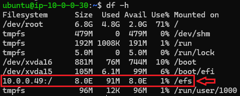

# Instalação do Wordpress utilizando uma máquina EC2
O programa de bolsas da Compass Uol apresentou o desafio de subir instâncias EC2 na AWS com um conteiner com a imagem do Wordpress, utilizando um banco de dados e um sistema de volumes fornecidos pela AWS, de forma escalável e segura. Para realização dessa tarefa, os seguintes passos foram seguidos:

- [Criação da VPC](#1--criação-da-vpc)
- [Security Groups](#2--security-groups)
- [Bando de dados RDS](#3--bando-de-dados-rds)
- [Montagem do EFS](#4--montagem-do-efs)
- [Montagem inicial da EC2](#5--montagem-inicial-da-ec2)
- [Docker Compose (yaml file)](#6--docker-compose-yaml-file)
- [Script para atualização do Banco de dados](#7--script-para-atualização-do-banco-de-dados) 
- [Arquivo user_data.sh](#8--arquivo-user_datash)
- [Template para EC2](#9--template-para-ec2)
- [Load Balancer](#10--load-balancer)
- [Auto Scaling Group](#11--auto-scaling-group)

  
## 1- Criação da VPC

Desenhou-se um modelo de VPC para acomodar toda a infraestrutura do projeto, com pensamento em melhorias futuras. Para isso, guardou-se os dois primeiros octetos para indicar a VPC que será utilizada (10.0.x.x), oara realizar essa indicação, a notação é 10.0.0.0/16.
Com a VPC criada, foram criadas 4 sub-redes, na zona us-east-1a foi criada uma pública com IPs 10.0.0.0/24 e uma privada com IPs 10.0.1.0/24, na zona us-east-1b foi criada uma pública com IPs 10.0.2.0/24 e uma privada com IPs 10.0.3.0/24. As sub-redes públicas recebem acesso a internet via internet gateway com acesso irrestrito (0.0.0.0/0) enquanto as privadas não recebem acesso a internet até então.
Para que as redes consigam acessar o gateway, é necessário uma tabela de rotas, desta forma a estrutura da VPC possui o seguinte formato:

  

## 2- Security Groups

Com a VPC criada, é importante definir quais os grupos de segurança, dessa forma pode-se indicar as permissões de acesso dentro das subredes. O banco de dados RDS e o sistema de volumes EFS serão colocados em um grupo privado, onde apenas as instancias privadas tem acesso a eles.
O banco de dados é acessado pela porta 3306, por isso define-se o acesso a 10.0.1.0/24:3306 e 10.0.3.0/24:3306.
O EFS é acessado pela porta 2049, por isso define-se o acesso a 10.0.1.0/24:2049 e 10.0.3.0/24:2049.
Para acessar as instancias privadas durante o processo, criou-se um Bastion Host em uma subnet publica para que com ele se consiga acessar as instancias privadas. É necessário assim criar um grupo de segurança para ele, conferindo acesso via protocolo SSH na porta 22 apenas para quem faz parte da VPC (10.0.0.0/16).
Criou-se um grupo de segurança para o load balancer com acesso irrestrito a porta HTTP 80 e a porta HTTPS 443.
Além desses, foi criado um grupo de segurança para as máquinas privadas.

  

### Inbound do project-wordpress-RDS

|SERVIÇO         |MAPEAMENTO                     |PORTA                        |
|----------------|-------------------------------|-----------------------------|
|MYSQL           |10.0.1.0/24                    |3306                         |
|MYSQL           |10.0.3.0/24                    |3306                         |

### Inbound do project-wordpress-EFS

|SERVIÇO         |MAPEAMENTO                     |PORTA                        |
|----------------|-------------------------------|-----------------------------|
|NFS             |10.0.1.0/24                    |2049                         |
|NFS             |10.0.3.0/24                    |2049                         |

### Inbound do project-wordpress-LB

|SERVIÇO         |MAPEAMENTO                     |PORTA                        |
|----------------|-------------------------------|-----------------------------|
|HTTP            |0.0.0.0/0                      |80                           |
|HTTPS           |0.0.0.0/0                      |443                          |

### Inbound do project-wordpress-priv-sg

|SERVIÇO         |MAPEAMENTO                     |PORTA                        |
|----------------|-------------------------------|-----------------------------|
|MYSQL           |project-wordpress-RDS          |3306                         |
|NFS             |project-wordpress-EFS          |2049                         |
|SSH             |10.0.0.0/16                    |22                           |
|HTTP            |project-wordpress-LB           |80                           |
|HTTPS           |project-wordpress-LB           |443                          |

### Inbound do project-wordpress-pub-sg

|SERVIÇO         |MAPEAMENTO                     |PORTA                        |
|----------------|-------------------------------|-----------------------------|
|SSH             |0.0.0.0/0                      |22                           |

## 3- Bando de dados RDS

Para o funcionamento do Wordpress, é necessário ter um banco de dados MySQL associado a ele como dependencia, para isso, utilizou-se do serviço da AWS chamado RDS (Relational Databases Service). Com ele é possível criar um banco de dados dentro da VPC. Utilizou-se os seguintes parametros:
- Engine Options
  - Engine type: MySQL
  - Engine version: 8.0.39
- Templates: Free tier
- Settings
  - DB instante id: database-1
  - Master username: secret
  - Master password: secret
- Instance Configuration
  - instance type: db.t3.micro
- Connectivity
  - VPC: project-wordpress-vpc
  - VPC security groups: project-wordpress-RDS
  - Availability Zone: No preference (us-east-1a e us-east-1b)
- Additional configuration
  - Initial database name: wordpressdb

As informações do banco serão utilizadas no yaml file do docker-compose que irá subir o conteiner do wordpress.

## 4- Montagem do EFS

Para garantir que os dados da aplicação persistam indementende das instâncias EC2, é necessário ter um volume a parte. A amazon fornece alguns serviços para essa função, um deles é o EFS (Elastic File System). 
Ao criar um EFS, indica-se a VPC a ser utilizada e clica-se em Customize para poder indicar o security group ao qual ele deve ser associado.
- General
  - Name: project-wordpress-efs
  - File system type: Regional
  - Throughput mode: Enhanced
- Network
  - VPC: project-wordpress-vpc
  - Mount targets
  - MT1:
    - Availability zone: us-east-1a
    - Subnet ID: wordpress-machine1-priv
    - IP address: Automatic
    - Security groups: project-wordpress-EFS
  - MT2:
    - Availability zone: us-east-1b
    - Subnet ID: wordpress-machine2-priv
    - IP address: Automatic
    - Security groups: project-wordpress-EFS

## 5- Montagem inicial da EC2

Para as configurações e testes iniciais, cria-se uma instancia EC2 limpa e com ela instala-se o docker, monta-se o EFS, instala-se o docker-compose e realiza-se o teste se todos os passos seguidos estão funcionando conforme o esperado. A instancia EC2 é criada com os seguintes parâmetros:
- Name and tags

|Key             |Value                          |Resource types               |
|----------------|-------------------------------|-----------------------------|
|Name            |*Fornecido pela Compasso*      |Instances & Volumes          |
|CostCenter      |*Fornecido pela Compasso*      |Instances & Volumes          |
|Project         |*Fornecido pela Compasso*      |Instances & Volumes          |
|Nome            |Instancia teste                |Instances & Volumes          |
- Application and OS Images
  - Quick Start: Ubuntu
  - AMI: Ubuntu Server 24.04 LTS
- Instance type: t2.micro
- key pair: Criada utilizando ED25519 .pem com a pública armazenada.
- Network settings - EDIT
  - VPC: project-wordpress-vpc
  - Subnet: wordpress-machine1-pub
  - Auto-assign public IP: Enable
  - Select existing security group
  - common security groups: project-wordpress-pub-sg
- Configure storage
  - root volume: 8gb gp2

Com a instancia criada, utiliza-se da conexão via ssh utilizando a chave pública e o endereço de ip da máquina.

~~~bash
sudo chmod 400 chavePub.pem
ssh -i chavePub.pem ubuntu@x.x.x.x
~~~

Onde no lugar de chavePub indica-se o nome da chave criada e em x.x.x.x indica-se o ipv4 da máquina criada.
> Importante lembrar que deve-se estar no diretório da chave para que o comando funcione, ou indicar o diretório da chave diretamente no comando.

Após acessar a máquina, tenta-se instalar o docker, iniciar o serviço, fornecer o direito de acesso ao docker ao usuário e habilitar para que o serviço do docker inicie sozinho na próxima reinicialização da máquina:

~~~bash
sudo apt update
sudo apt upgrade

sudo apt-get install docker.io -y
sudo systemctl start docker
sudo usermod -aG docker ubuntu
sudo systemctl enable docker
~~~

Com o docker instalado, instala-se o efs-utils para conseguir montar o EFS. A ferramenta efs-utils vem por padrão no yum nas instancias Amazon Linux, mas nas instancias ubuntu utiliza-se o nfs-common.
Após instalado, é necessário criar uma pasta onde será montado o EFS, decidiu-se montar em /efs. Para que este disco persista na montagem, é necessário indicar no /etc/fstab a montagem desse disco.
O comando para a montagem do disco pode ser obtido clicando em Attach no EFS, existem duas opções, via DNS e via IP, escolhi a oção via IP e defini a zona.

~~~bash
#Instala o nfs-common e monta o efs no sistema
sudo apt-get -y install nfs-common
sudo mkdir /efs
sudo mount -t nfs4 -o nfsvers=4.1,rsize=1048576,wsize=1048576,hard,timeo=600,retrans=2,noresvport 10.0.0.49:/ /efs
sudo chmod 666 /etc/fstab
sudo echo "10.0.0.49:/     /efs      nfs4      nfsvers=4.1,rsize=1048576,wsize=1048576,hard,timeo=600,retrans=2,noresvport,_netdev      0      0" >> /etc/fstab
~~~

Após a instalação do EFS é possível notar que ele está montado com o comando:

~~~bash
df -h
~~~

  

Após a montagem do EFS, pode-se instalar o docker-compose

~~~bash
sudo curl -L https://github.com/docker/compose/releases/latest/download/docker-compose-$(uname -s)-$(uname -m) -o /usr/local/bin/docker-compose
sudo chmod +x /usr/local/bin/docker-compose
~~~

Com o docker-compose instalado, é possível realizar o teste para subir a instancia. Para isso, é necessário criar o yaml file.
  
## 6- Docker Compose (yaml file)

O Docker Compose permite que se escreva um arquivo onde se define todas as informações necessárias para subir um conteiner sem a necessidade de realizar todas as configurações via linha de comando. O Wordpress necessita alocar arquivos e dados, os arquivos serão alocados em um volume, no caso o EFS, e os dados serão alocados em um banco de dados, no caso o MySQL criado com o RDS. Para garantir segurança nos dados, utilizou-se de secrets no yaml file. Indica-se o serviço que será criado, a imagem que ser´´a utilizada, garante a reinicialização do serviço e indica-se a porta, onde na porta 8080 será escutado todo o tráfego vindo da porta 80 do conteiner. Indica-se as variáveis de ambiente confidenciais via secrets e não confidenciais diretamente. Indica-se as secrets e depois o volume, que receberá os dados vindos da pasta /var/html/www do container e alocará na pasta /efs/website do EFS. Os arquivos onde serão coletados os secrets é indicado abaixo. eles serão salvos dentro do container em /var/secrets/.

~~~yaml
services:
  wordpress:
    image: wordpress
    restart: always
    ports:
      - 80:80
    environment:
      WORDPRESS_DB_HOST_FILE: /run/secrets/db_host
      WORDPRESS_DB_USER_FILE: /run/secrets/db_user
      WORDPRESS_DB_PASSWORD_FILE: /run/secrets/db_password
      WORDPRESS_DB_NAME: wordpressdb
    secrets:
      - db_host
      - db_password
      - db_user
    volumes:
      - /efs/website:/var/www/html

secrets:
  db_password:
    file: db_password.txt
  db_host:
    file: db_host.txt
  db_user:
    file: db_user.txt
~~~

Com o arquivo criado, basta utilizar o docker compose indicando o nome do arquivo para que ele suba a instancia em background

~~~bash
docker-compose -f wordpress.yaml up -d
~~~

Com a instância criada, acessa-se o endereço dado pelo ip publico da maquina seguido de :8080 para verificar se na porta 80 o serviço está funcionando.

## 7- Script para atualização do Banco de dados

Como o banco de dados armazena o IP que deve ser acessado em wp_options e a máquina muda de IP a cada nova criação, foi necessário atualizar a url para o acesso correto. Esta URL está no wp_options onde o 'option_name' é 'siteurl', deve ser alterado o option_value para http://(ipv4 publico):8080. Para isso, foi criado um script que acessa o banco de dados e altera essa parte do banco de dados. Esse script foi salvo em /efs/script_sql.sh

~~~bash
#!/bin/bash
IP_EX2="UPDATE wp_options SET option_value = 'http://$(curl http://checkip.amazonaws.com):8080' WHERE option_name = 'siteurl';"

sudo apt install mysql-client -y
host=$(cat /efs/db_host.txt) && user=$(cat /efs/db_user.txt) && pw=$(cat /efs/db_password.txt)

mysql -h $host -u $user -p$pw wordpressdb -e "$IP_EX2"
~~~

## 8- Arquivo user_data.sh

Com tudo funcionando na instância de teste, pode-se preparar um arquivo executável responsável por realizar todos os comandos assim que uma instancia for criada, para isso a AWS fornece um serviço na criação da isntancia para indicar um user_data.sh. Este arquivo é executado no momento de criação da instância, alguns cuidados devem ser tomados pois no momento em que esse arquivo sobe a instancia ainda está com o usuário sudo e ainda não foram montados a maioria dos diretórios, um dos unicos montados é o /etc. Reunindo todos os códigos utilizados na instancia, tem-se o seguinte user_data.sh:
~~~bash
#!/bin/bash

#Atualiza a lista de pacotes
sudo apt update

#Atualiza os pacotes
sudo apt upgrade

#Instala o Docker, starta e garante que inicia junto ao sistema
sudo apt-get install docker.io -y
sudo systemctl start docker
sudo usermod -aG docker ubuntu
sudo systemctl enable docker

#Instala o nfs-common e monta o efs no sistema
sudo apt-get -y install nfs-common
sudo mkdir /efs
sudo mount -t nfs4 -o nfsvers=4.1,rsize=1048576,wsize=1048576,hard,timeo=600,retrans=2,noresvport 10.0.0.49:/ /efs
sudo chmod 666 /etc/fstab
sudo echo "10.0.0.49:/     /efs      nfs4      nfsvers=4.1,rsize=1048576,wsize=1048576,hard,timeo=600,retrans=2,noresvport,_netdev      0      0" >> /etc/fstab

#Instala o Docker compose
sudo curl -L https://github.com/docker/compose/releases/latest/download/docker-compose-$(uname -s)-$(uname -m) -o /usr/local/bin/docker-compose
sudo chmod +x /usr/local/bin/docker-compose

#Sobe o conteiner do Wordpress
sudo docker-compose -f /efs/wordpress.yaml up -d

#Atualiza o mysql com o ip atual
sudo bash /efs/script_sql.sh
~~~
  
## 9- Template para EC2

Com o user_data.sh montado, é possível definir um template que será utilizado para criar novas instancias, sem a necessidade de configurar tudo novamente a cada instancia EC2 criada.
A AWS possui a ferramenta Launch Templates, onde clica-se em Create Launch Template. As informações utilizadas foram:

- Launch Template Name: wordpress-template
- Auto Scaling guidance: Ativo
- Application and OS Images
  - Quick Start: Ubuntu
  - AMI: Ubuntu Server 24.04 LTS
- Instance type: t2.micro
- key pair: Criada utilizando ED25519 .pem com a pública armazenada.
- Network settings
  - Subnet: wordpress-machine1-pub
  - Select existing security group
  - common security groups: project-wordpress-pub-sg
  - Auto-assign public IP: Enable
  - Advanced network configuration
    - Auto-assign public IP: Enable
- Storage (volumes)
  - Volume 1 (AMI Root)
    - root volume: 8gb **gp2**
- Resource Tags

|Key             |Value                          |Resource types               |
|----------------|-------------------------------|-----------------------------|
|Name            |*Fornecido pela Compasso*      |Instances & Volumes          |
|CostCenter      |*Fornecido pela Compasso*      |Instances & Volumes          |
|Project         |*Fornecido pela Compasso*      |Instances & Volumes          |
|Nome            |InstanciaEC2-1                 |Instances & Volumes          |

- Advanced details
  - User data - optional: Informar o user_data.sh
  
## 10- Load Balancer

## 11- Auto Scaling Group

Para que caso o serviço peça mais recursos do que a instância EC2 possa fornecer, é possível definir um ASG, onde indica-se qual a métrica que deve ser utilizada para indicar se é necessário subir uma nova instancia para auxiliar e quantas instancias devem estar rodando no mínimo, no máximo e qual o valor desejado. Para isso utilizou-se do Auto scaling group com as seguintes configurações:
- Name: project-wordpress-asg
- Launch template: wordpress-template
- Network
  - VPC: project-wordpress-vpc
  - Available Zones
    - wordpress-machine1-pub
    - wordpress-machine2-pub
- Load balancing: No load balancer
- Group size
  - Desired capacity: 1
- Scaling
  - Min desired capacity: 1
  - Max desired capacity: 4
  - Target tracking scaling policy: Ativo
  - Metric type: Average CPU utilization
  - Target value: 40
  - Instance warmup: 300 seconds
- Instance maintenance policy: No policy

  
## 12- Stress test

## Resultados Gerais
